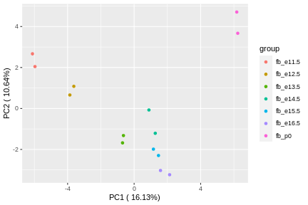

### Introduction

**ASTK** is a command line software for comprehensive alternative splicing analysis(AS) analyses including AS event analysis, AS gene function analysis, potential regulatory mechanism analysis of AS.

-------------------------

### Installation

```bash
## create a new conda environment for astk and install python and R
$ conda create -n astk -c conda-forge r-base=4.1 python=3.8 -y
## activate conda environment
$ conda activate astk

## install the development version from github
$ pip install git+https://github.com/huang-sh/astk.git@dev

# or install from PyPi
$ pip install astk 
```

After installed **astk**, you should install **astk**' dependent R packages with:

```bash
$ astk install -r 
...
```

### Command

**ASTK** works with a command/subcommand structure:

```bash
astk subcommand options
```

**ASTK** provides multiple groups sub-commands for comprehensive AS analysis:

**AS differential splicing analysis**

* **meta**: generate metadata of AS differential splicing analysis contrast groups; it's helpful when you have multiple condition for anlysis
* **generateEvent**: generate AS events using genome GTF annotation
* **generatePsi**: calculates AS events PSI values
* **diffSplice**: run AS differential splicing analysis
* **dsflow**: wrapper of **generateEvent**, **generatePsi** and **diffSplice**

**PSI/dPSI analysis and plot**

* **sigFilter**: select significant AS event
* **psiFilter**: filter AS event with PSI value
* **pca**: PSI value PCA ploting
* **heatmap**: PSI value heatmap ploting
* **volcano**: dPSI value volcano ploting
* **upset**: AS event upset ploting

**alternative exon/intron lenght analysis**

* **lenCluster**: AS event clustering based on alternative exon/intron length
* **lenDist**: alternative exon/intron length distribution plotting
* **lenPick**: selecting specfic exon/intron length of AS event

**gene function enrichment analysis**

* **enrich**: AS gene function enrichment
* **enrichCompare**: AS gene function comparsion
* **gsea**: gene set enrichment analysis
* **nease**: AS events analysis using NEASE

**motif analysis**

* **motifEnrich**：motif enrichment
* **motifFind**：motif discovery
* **motifPlot**: motif plot
* **motifMap**：motit RNA map
* **getmeme**: extract motif from a meme motif file
* **seqlogo**: draw seqLogo figure

**chromatin analysis**

* **signalProfile**：profile chromatin signal of splicing sites

**Eukaryotic Linear Motif**

* **elms**： search Eukaryotic Linear Motifs within amino acid sequence coding by alternative exon DNA sequence.  

**AS sites coordinate extract**

* **getcoor**, extract AS site coordiante and generate BED file and fasta file, it also can set AS site upstream or downstream width.

**useful utilities**

* **install**: install other dependent software
* **list**: list 20 orgnism annotation OrgDb

### Usage

#### Prepare

transcript TPM quantitative file is required for **astk** input. In the example analysis , we use RNA-seq data of mouse forebrain, midbrain and hindbrain RNA-Seq data from embryonic 11.5-16.5 day and p0. And **salmon** was used for transcript TPM.

you can download data from [encode forbrain](https://www.encodeproject.org/search/?type=Experiment&control_type!=*&assay_term_name=polyA%20plus%20RNA-seq&replicates.library.biosample.donor.organism.scientific_name=Mus%20musculus&biosample_ontology.term_name=forebrain&status=released)

**exammple**
According to the [tutorial](https://combine-lab.github.io/alevin-tutorial/2019/selective-alignment/)

```
$ salmon index -t gentrome.fa.gz -d decoys.txt -p 12 -i salmon_index --gencode
$ salmon quant -i salmon_index --gcBias --useVBOpt --seqBias  -r ENCFF329ACL.fastq.gz --validateMappings -o fb_e11.5_rep1 -p 30
$ ls fb_e11.5_rep1
aux_info  cmd_info.json  lib_format_counts.json  libParams  logs  quant.sf
```

> NOTE: --gencode is required.

And we get following output including quantification data of fb embryonic development stages

```
$ ls data/quant/fb*/*quant.sf

data/quant/fb_e10.5_rep1/quant.sf  data/quant/fb_e12.5_rep1/quant.sf  data/quant/fb_e14.5_rep1/quant.sf  data/quant/fb_e16.5_rep1/quant.sf
data/quant/fb_e10.5_rep2/quant.sf  data/quant/fb_e12.5_rep2/quant.sf  data/quant/fb_e14.5_rep2/quant.sf  data/quant/fb_e16.5_rep2/quant.sf
data/quant/fb_e11.5_rep1/quant.sf  data/quant/fb_e13.5_rep1/quant.sf  data/quant/fb_e15.5_rep1/quant.sf  data/quant/fb_p0_rep1/quant.sf
data/quant/fb_e11.5_rep2/quant.sf  data/quant/fb_e13.5_rep2/quant.sf  data/quant/fb_e15.5_rep2/quant.sf  data/quant/fb_p0_rep2/quant.sf

```

#### meta

**meta** is used to generate contrast group metadata table for AS differential splicing analysis.

For example, we can generate multiple developmental stage contrast groups with e11.5 stage as control:

```bash
$ mkdir metadata -p
$ astk meta -o metadata/fb_e11_based -repN 2 \
    -p1 data/quant/fb_e11.5_rep*/quant.sf \
    -p2 data/quant/fb_e1[2-6].5_rep*/quant.sf  data/quant/fb_p0_rep*/quant.sf \
    -gn fb_e11_12 fb_e11_13 fb_e11_14 fb_e11_15 fb_e11_16 fb_e11_p0

```

**meta** arguments

* -o:  output file path
* -repN:  number of replicate samples
* -p1: condition 1(control) sample transcript quantification files path
* -p2: condition 2(treatment) sample transcript quantification files path

the output of **meta** is a CSV file and JSON file. CSV file is convenient for viewing in excel, and JSON file will be used in other sub-commands.


#### dsflow

**dsflow** is wrapper of **generateEvent**, **generatePsi** and **diffSplice**. It's used to simplify the differential splicing analysis workflow. And above 7 contrast groups differential splicing analysis could be performed with one command line:

```bash
$ mkdir result
$ gtf=gencode.vM25.annotation.gtf # download from GENCODE
$ astk dsflow -od result/fb_e11_based -md metadata/fb_e11_based.json -gtf $gtf -t ALL &

$ ls result/fb_e11_based
dpsi  psi  ref  tpm
```

**dsflow** arguments:

* -od: output directory
* -md: meta data, the meta output json file
* -gtf: genome annotation GTF file
* -t: alternative splicing type, ALL is for all supported types.

the output of **dsflow**  contain four directories:

* ref is the directory including AS event reference annotation files;
* tpm is the directory including sample TPM files;
* psi is the directory including AS event PSI file
* dpsi  is the directory including differential splicing result.

#### generateEvent

**generateEvent** is used to infer AS events from genome GTF annotation file.

``` bash
$ astk generateEvent -gtf $gtf -et SE --split FTE \
    -o result/fb_e11_based/ref/gencode.vM25

```

**generateEvent** arguments:

* -gtf: genome annotation GTF file
* -et: AS event type
* --split: inner|FTE|LTE, Filter AS events based on whether first or last exon of event is the same as the first exon or the last exon of transcript.
* -o: output path

#### generatePsi

**generatePsi** is used to calulate PSI of AS event.

```bash
$ astk generatePsi -o result/fb_e11_based/psi/fb_SE_FT_e10.psi \
    -qf data/quant/fb_e10.5_rep*/quant.sf \
    -ioe result/fb_e11_based/ref/gencode.vM25_FT_SE_strict.ioe

$ astk generatePsi -o result/fb_e11_based/psi/fb_SE_FT_e16.psi \
    -qf data/quant/fb_e16.5_rep*/quant.sf \
    -ioe result/fb_e11_based/ref/gencode.vM25_FT_SE_strict.ioe

$ head result/fb_e11_based/psi/fb_SE_FT_e10.psi
event_id        fb_e10.5_rep1   fb_e10.5_rep2
ENSMUSG00000025902.13;SE:chr1:4493863-4495136:4495942-4496291:- 0.20508467461294735     0.16355428896798765
ENSMUSG00000025902.13;SE:chr1:4493863-4495136:4495198-4496291:- 0.1034743140228213      0.1685190853710221
ENSMUSG00000033845.13;SE:chr1:4782733-4783951:4784105-4785573:- 0.2311769118443923      0.24830839809502564
ENSMUSG00000002459.17;SE:chr1:4916980-4923847:4923989-5019311:- 0.6018668424886171      0.5701945236664067

## it also will extract TPM value from transcript quantification files
$ head result/fb_e11_based/psi/fb_SE_FT_e10.tpm -n 3
Name    fb_e10.5_rep1   fb_e10.5_rep2
ENSMUST00000193812.1    0.0     0.0
ENSMUST00000082908.1    0.0     0.0
```

**generatePsi** arguments:
* -o: output path
* -gtf: genome annotation GTF file
* -et: AS event type
* --split: inner|FTE|LTE, Filter AS events based on whether first or last exon of event is the same as the first exon or the last exon of transcript.

#### diffSplice

**diffSplice** is used to perform AS differential splicing analysis. The core algorithm is based on [SUPPA2](https://github.com/comprna/SUPPA).

```bash
$ astk diffSplice -psi result/fb_e11_based/psi/fb_SE_FT_e10.psi \
    -exp result/fb_e11_based/psi/fb_SE_FT_e10.tpm \
    -ref result/fb_e11_based/ref/gencode.vM25_FT_SE_strict.ioe \
    -o result/fb_e11_based/dpsi/fb_FT_SE_e10_p0.dpsi 
```

**diffSplice** arguments:

* -psi: AS events PSI files
* -exp: transcripts TPM expression files
* -ref: ioe reference file
* -o: output file


#### sigFilter

**sigFilter** is using for filter significant differential splicing event according to PSI and p-value. It will generate significant  differential splicing events and associated PSI files. **sf** is short alias of **sigFilter**.

```bash
$ astk sf -i result/fb_e11_based/dpsi/*.dpsi \
        -pf1 result/fb_e11_based/psi/*_c1.psi \
        -pf2 result/fb_e11_based/psi/*_c2.psi \
        -od result/fb_e11_based/sig01 -adpsi 0.1 -p 0.05

```

**sf** arguments

* FILES...: input dpsi files
* -pf1: the control psi files
* -pf2: the treatment psi files
* -od: output directory
* -adpsi: absolute dPSI threshold value
* -p: p-value threshold value

the output of **sigFilter**  contain five types  of files (with - adpsi):

* "c1.sig.psi"  suffix is the PSI file of condition 1(control) involved significant differential splicing events

* "c2.sig.psi"  suffix is the PSI file of condition 2(treatment) involved significant differential splicing events

* "sig.dpsi" is the all significant differential splicing events inluding dpsi value and pvalue

* "sig+.dpsi" is the significant differential splicing events with dpsi value > adpsi

* "sig-.dpsi" is the significant differential splicing events with dpsi value < adpsi

#### psiFilter

**psiFilter** is used to filter AS event with PSI value.

```bash
$ astk pf -i result/fb_e11_based/psi/fb_e11_p0_SE_c2.psi \
    -psi 0.8 -o result/fb_e11_based/psi/fb_e11_p0_SE_c2_08.psi
$ astk pf -i result/fb_e11_based/psi/fb_e11_p0_SE_c2.psi \
    -psi -0.2 -o result/fb_e11_based/psi/fb_e11_p0_SE_c2_02.psi
```

**psiFilter** arguments

* FILE: input psi file
* -psi: when option value > 0, it denotes that select AS events that PSI > option value; however, when option value < 0, it denotes that select AS events that PSI < abs(option value)
* -o: output file

#### pca

**pca** sub-commands is using for PCA analysis of PSI.

```bash
$ astk pca -i result/fb_e11_based/psi/fb_e11_12_SE_c1.psi \
    result/fb_e11_based/psi/fb_e11_1[2-6]_SE_c2.psi \
    result/fb_e11_based/psi/fb_e11_p0_SE_c2.psi \
    -o img/fb_pca.png -fmt png -w 6 -h 4

```

**pca** arguments

* -i : PSI files

* -o: output figure



#### heatmap

**heatmap** is used for ploting heatmap of PSI. **hm** is short alias of **heatmap**. 

```bash
$ astk hm -i result/fb_e11_based/sig01/fb_e11_12_SE_c1.sig.psi \
    result/fb_e11_based/sig01/fb_e11_1*_SE_c2.sig.psi \
    -o img/fb_hm.png -fmt png

docker run -v ~/project/astk/demo:/project/demo -e LOCAL_USER_ID=$(id -u) astk:0.0.1b \
    astk hm -i demo/result/fb_e11_based/sig01/fb_e11_12_SE_c1.sig.psi \
        demo/result/fb_e11_based/sig01/fb_e11_1*_SE_c2.sig.psi \
        -o demo/img/fb_hm1.png -fmt png
```

**heatmap** arguments

* -i : PSI files
* -o: output figure
* -o : output path


#### volcano

**volcano** is used for dPSI volcano ploting.  **vol** is short alias of **volcano**.

```bash
$ astk volcano -i result/fb_e11_based/dpsi/fb_e11_p0_SE.dpsi \
    -o img/fb_e11_p0_SE.vol.png 

```

**vol** arguments:

* -i : input dpsi files, support multiple files
* -o: output directory


#### upset

**upset** is used for dPSI upset ploting.  **vol** is short alias of **upset**.

```bash
$ astk upset -i result/fb_e11_based/sig01/fb_e11_12_SE.sig.dpsi \
    result/fb_e11_based/sig01/fb_e11_14_SE.sig.dpsi \
    result/fb_e11_based/sig01/fb_e11_16_SE.sig.dpsi \
    -o img/fb_upset.png -xl e11_12 e11_14 e11_16 

```

**upset** arguments:

* -i : input dpsi files, support multiple files
* -o: output directory
* -o: output directory


#### lenCluster

**lenCluster** provide a function for cluster AS events based on alternative exon/intron  length. **lc** is short alias of **lenCluster**.

```bash
$ astk lc result/fb_e11_based/sig01/*dpsi -lr 1 51 251 1001 \
-od result/fb_e11_based/sig01

```

**lc** arguments:

* -i: input dpsi files
* -lr: length range
* -od: output directory
* -fmt: figure format

#### enrich

**enrich** is used for genes GO term enrichment enrichment. GO term enrichment map networks and enrichment clustering are provided.

```bash
$ mkdir img/enrich -p
$ astk enrich -i result/fb_e11_based/sig01/fb_e11_13_SE.sig.dpsi \
    -ont BP -qval 0.1 -orgdb mm  -fmt png \
    -od img/enrich/fb_e11_13_SE 

```

**enrich** arguments:

* -i: dpsi file
* -ont:  ontology
* -od : output directory
* -qval : q-value
* -orgdb : OrgDb code for annotation, run `astk ls -orgdb` to show the code list

GO terms enrichment result and enrichment clustering  have figure and text formats.

#### enrichCompare

**enrichCompare** is used for  gene functional characteristics comparison of different AS genes, short alias: **ecmp**.

Comparison between The dpsi > 0.1 and dpsi < 0.1 in the 7 group (fb_16.5 vs fb_p0)

```bash
$ mkdir img/ecmp
$ astk ecmp -i result/fb_e11_based/sig01_*/fb_e11_12_SE.sig.dpsi \
     -ont BP -orgdb mm  -fmt png \
     -od img/enrich/fb_e11_12_SE_lc
```

**enrichCompare** arguments:

* -i : dpsi files
* -od : output directory
* -ont : ontology
* -qval : q-value
* -orgdb : OrgDb code for annotation, run `astk ls -orgdb` to show the code list


#### motifEnrich

**motifEnrich** is used for performing motif enrichment within splicing sites flanking sequence using RBP motif database. me is short alias.

```bash
$ astk me -te result/fb_e11_based/psi/fb_e11_p0_SE_c2_08.psi \
    -ce result/fb_e11_based/psi/fb_e11_p0_SE_c2_02.psi \
    -od img/motif/fb_e11_p0_SE_me -org mm \
    -fi GRCm38.primary_assembly.genome.fa

```

Arguments:

* -te: input treatment event file
* -ce: input control event file
* -od: output directory
* -org: organism
* -fi: genome fasta, need indexed


#### motifFind

**motifFind** is used for performing motif discovery and the compared to known RBP motif. mf is short alias.

```bash
astk mf -te result/fb_e11_based/psi/fb_e11_p0_SE_c2_08.psi \
    -od img/motif/fb_e11_p0_SE_mf -org mm \
    -fi GRCm38.primary_assembly.genome.fa
```

Arguments:

* -te: input treatment event file
* -od: output directory
* -org: organism


#### getmeme

**getmeme** is used for querying ASTK built-in motif data.

```bash 
astk getmeme M316_0.6 M083_0.6 -db CISBP-RNA \
    -org mm -o img/motif/query.meme
```

Arguments:

* MOTIFID...: input motif IDs
* -db: motif database
* -org: organism
* -o: output file path
* 

#### motifPlot

**motifPlot** is used for drawing motif figure using motif meme data

```bash
astk mp -mi M316_0.6 M083_0.6 -mm img/motif/query.meme \
    -o img/motif/motif_plot.png
```

Arguments:

* MOTIFID...: input motif IDs
* -db: motif database
* -org: organism
* -o: output file path


#### mmap

**mmap** is used for generating motif map to show motif distribution.

```bash
astk mmap -e result/fb_e11_based/psi/fb_e11_p0_SE_c2_08.psi \
    -n a1 a2 a3 a4 -c 150 150 150 150 \
    -mm img/motif/query.meme -od img/motif/motif_map \
    -fi GRCm38.primary_assembly.genome.fa
```

Arguments:

* -fa: input fasta files
* -n: fasta files names
* -c: center positions
* -mm: motif meme file
* -od: output directory
* 

#### signalProfile

**signalProfile** is used to profile chromatin signal of splicing sites flank.

```bash
astk pf -i result/fb_e11_based/psi/fb_e11_16_AF_c2.psi \
    -psi 0.8 -o result/fb_e11_based/psi/fb_16_AF_08.psi

astk signalProfile -o img/fb_16_AF_low_ATAC.png \
    -e result/fb_e11_based/psi/fb_16_AF_08.psi \
    -bw /home/huangshenghui/project/AD/others/astk/ATAC.e16.5.fb.bigwig \
    -ssl A1 A2 A3 A4 A5 -fmt png

```

Arguments:

* -o: output file
* -e: AS event file that including  AS event ID
* -bw: bigwig file
* -ssl: splicing site labels
* -fmt: figure format


#### elms

**elms** is using for searching Eukaryotic Linear Motifs within amino acid sequence coding by alternative exon sequence.

```bash
astk elms -i result/fb_e11_based/sig01/fb_e11_p0_SE.sig.dpsi -g mm10 -o img/elm.csv
```

Arguments:

* -i: dpsi file path
* -g: genome assembly
* -o: output
