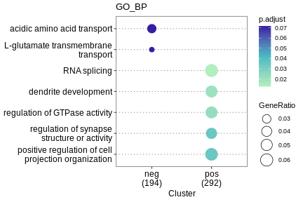

### Introduction

**ASTK** is a command line software for comprehensive alternative splicing analysis(AS) analyses including AS event analysis, AS gene function analysis, potential regulatory mechanism analysis of AS. 

-------------------------

### Installation

```bash
## create a new conda environment for astk and install python and R
$ conda create -n astk -c conda-forge r-base=4.1 python=3.8 -y
## activate conda environment
$ conda activate astk
## install astk
$ pip install astk
```
or install the development version from github
```
pip install git+https://github.com/huang-sh/astk.git@dev
```

After install **astk**, you should install **astk**' dependent R packages with:

```bash
$ astk install -r 
...
```

### Command

**ASTK** works with a command/subcommand structure:

```bash
astk subcommand options
```

**ASTK** provides multiple groups sub-commands for comprehensive AS analysis:

**AS differential splicing analysis**

* **meta**: generate metadata of AS differential splicing analysis contrast groups;it's helpful when you have multiple contrast groups for anlysis
* **diffSplice**: run AS differential splicing analysis
* **sigfilter**: select significant data  

**PSI/dPSI analysis and plot**

* **pca**: PSI value PCA ploting
* **heatmap**: PSI value heatmap ploting
* **volcano**: dPSI value volcano ploting
* **upset**: AS event upset ploting

**alternative exon/intron lenght analysis**

* **lenCluster**: AS event clustering based on alternative exon/intron length
* **lenPick**: selecting specfic exon/intron length of AS event

**gene function enrichment analysis**

* **enrich**: AS gene function enrichment
* **enrichCompare**: AS gene function comparsion
* **gsea**: gene set enrichment analysis
* **nease**: AS events analysis using NEASE

**motif analysis**

* **motifEnrich**：motif enrichment
* **motifFind**：motif discovery
* **motifPlot**: motif plot
* **motifMap**：motit RNA map
* **getmeme**: extract motif from a meme motif file

**Co-splicing network**

* **csnet**:  inferring co-splicing networks based on RBP motif discovery and co-expression of RBP gene expression and AS events PSI values.

**epigenetics modification analysis**

* **epi**： extract epigenetic signal features within alternative splicing sites flank
* **epihm**：draw heatmap figure of mean epigenetic signal features within alternative splicing sites flank.
* **sigcmp**：epigenetic signal features significance test between different alternative splicing sites flank using wilcox test.

**Eukaryotic Linear Motif**

* **elms**： search Eukaryotic Linear Motifs within amino acid sequence coding by alternative exon DNA sequence.

**AS sites coordinate extract**

* **anchor**, generate coordinate anchor file as **epi** input required
* **getcoor**, extract AS site coordiante and generate BED file and fasta file, it also can set AS site upstream or downstream width.

**useful utilities**

* **install**: install other dependent software
* **list**: list 20 orgnism annotation OrgDb

### Usage

#### Prepare

transcript TPM quantitative file is required for **astk** input. In the example analysis , we use RNA-seq data of mouse forebrain, midbrain and hindbrain RNA-Seq data from embryonic 11.5-16.5 day and p0. And **salmon** was used for transcript TPM.

you can download data from [encode forbrain](https://www.encodeproject.org/search/?type=Experiment&control_type!=*&assay_term_name=polyA%20plus%20RNA-seq&replicates.library.biosample.donor.organism.scientific_name=Mus%20musculus&biosample_ontology.term_name=forebrain&status=released)

**exammple**
According to the [tutorial](https://combine-lab.github.io/alevin-tutorial/2019/selective-alignment/)

```
$ salmon index -t gentrome.fa.gz -d decoys.txt -p 12 -i salmon_index --gencode
$ salmon quant -i salmon_index --gcBias --useVBOpt --seqBias  -r ENCFF329ACL.fastq.gz --validateMappings -o fb_e11.5_rep1 -p 30
$ ls fb_e11.5_rep1
aux_info  cmd_info.json  lib_format_counts.json  libParams  logs  quant.sf
```

> NOTE: --gencode is required.

And we get following output including quantification data of fb embryonic development stages

```
$ ls data/quant/fb*/*quant.sf

data/quant/fb_e10.5_rep1/quant.sf  data/quant/fb_e12.5_rep1/quant.sf  data/quant/fb_e14.5_rep1/quant.sf  data/quant/fb_e16.5_rep1/quant.sf
data/quant/fb_e10.5_rep2/quant.sf  data/quant/fb_e12.5_rep2/quant.sf  data/quant/fb_e14.5_rep2/quant.sf  data/quant/fb_e16.5_rep2/quant.sf
data/quant/fb_e11.5_rep1/quant.sf  data/quant/fb_e13.5_rep1/quant.sf  data/quant/fb_e15.5_rep1/quant.sf  data/quant/fb_p0_rep1/quant.sf
data/quant/fb_e11.5_rep2/quant.sf  data/quant/fb_e13.5_rep2/quant.sf  data/quant/fb_e15.5_rep2/quant.sf  data/quant/fb_p0_rep2/quant.sf

```

#### meta

It's easy to generate multiple condition contrast groups with **meta**. For example, we can quickly generate multiple adjacent development stages contrast groups using:

```bash
$ mkdir metadata
$ astk meta -o metadata/fb_e11_based.csv -repN 2 \
    -p1 data/quant/fb_e11.5_rep*/quant.sf \
    -p2 data/quant/fb_e1[2-6].5_rep*/quant.sf  data/quant/fb_p0_rep*/quant.sf \
    -gn fb_e11_12 fb_e11_13 fb_e11_14 fb_e11_15 fb_e11_16 fb_e11_p0

```

**meta** arguments

* -o:  output file path
* -repN:  number of replicate samples
* -p1: condition 1(control) sample transcript quantification files path
* -p2: condition 2(treatment) sample transcript quantification files path

the output of **meta** is a CSV file and JSON file. CSV file is convenient for viewing in excel, and JSON file will be used in next sub-commands.


#### diffSplice

**ds** is short alias of **diffSplice**. They have the same function.  The core algorithm of differential splicing analysis is based on **SUPPA2**. In the **astk**,  the differential splicing analysis steps are simplified. And above 7 contrast groups differential splicing analysis could be performed with one command line:

```bash
$ mkdir diff
$ gtf=gencode.vM25.annotation.gtf
$ astk ds -od diff/fb_e11_based -md metadata/fb_e11_based.json -gtf $gtf -t all &

$ ls diff/fb_e11_based
dpsi  psi  ref  tpm
```

**ds** arguments:

* -od: output directory
* -md: meta data, the meta output json file
* -gtf: genome annotation GTF file
* -t: alternative splicing type, all is  including all supported types.

the output of **diffSplice**  contain four directories:

* ref is the directory including reference annotation files;
* tpm is the directory including sample TPM file;
* psi is the directory including alternative spliceing event PSI file;
* dpsi  is the directory including differential splicing result.

#### lenCluster

**lenCluster** provide a function for cluster AS events based on alternative exon/intron  length. **lc** is short alias of **lenCluster**.

```bash
$ astk lc diff/fb_e11_based/sig01/*dpsi -lr 1 51 251 1001 \
-od diff/fb_e11_based/sig01

```

**lc** arguments:

* FILES...: input dpsi files
* -lr: length range
* -od: output directory
* -fmt: figure format


#### sigfilter

**sigfilter** is using for filter significant differential splicing event according to PSI and p-value. It will generate significant  differential splicing events and associated PSI files. **sf** is short alias of **sigfilter**.

```bash
$ astk sf diff/fb_e11_based/dpsi/*.dpsi \
        -pf1 diff/fb_e11_based/psi/*_c1.psi \
        -pf2 diff/fb_e11_based/psi/*_c2.psi \
        -od diff/fb_e11_based/sig01 -adpsi 0.1 -p 0.05

```

**sf** arguments

* FILES...: input dpsi files
* -pf1: the control psi files
* -pf2: the treatment psi files
* -od: output directory
* -adpsi: absolute dPSI threshold value
* -p: p-value threshold value

the output of **sigfilter**  contain five types  of files (with - adpsi):

* "c1.sig.psi"  suffix is the PSI file of condition 1(control) involved significant differential splicing events

* "c2.sig.psi"  suffix is the PSI file of condition 2(treatment) involved significant differential splicing events

* "sig.dpsi" is the all significant differential splicing events inluding dpsi value and pvalue

* "sig+.dpsi" is the significant differential splicing events with dpsi value > adpsi

* "sig-.dpsi" is the significant differential splicing events with dpsi value < adpsi

#### pca

**pca** sub-commands is using for PCA analysis of PSI.

```bash
$ mkdir img/pca -p
$ astk pca diff/mb_e11_based/sig01/mb_e11_12_SE_c1.sig.psi \
    diff/mb_e11_based/sig01/mb_e11_1*_SE_c2.sig.psi \
    -o img/mb_pca.png -fmt pdf -w 6 -hi 4

```

**pca** arguments

* -i : PSI files

* -o: output figure


#### heatmap

**heatmap** is used for ploting heatmap of PSI. **hm** is short alias of **heatmap**. 

```bash
$ mkdir img/hm
$ astk hm diff/mb_e11_based/sig01/mb_e11_12_SE_c1.sig.psi \
    diff/mb_e11_based/sig01/mb_e11_1*_SE_c2.sig.psi \
    -o img/hm/mb_hm.png -fmt png

```

**heatmap** arguments

* -i : PSI files
* -o: output figure
* -cls: AS event cluster json file
* -o : output path


#### volcano

**volcano** is used for dPSI volcano ploting.  **vol** is short alias of **volcano**.

```bash
$ mkdir img/volcano -p
$ astk volcano diff/fb_e11_based/dpsi/fb_e11_12_SE.dpsi \
    -o img/volcano/fb_e11_12_SE.vol.png 

```

**vol** arguments:

* -i : input dpsi files, support multiple files
* -o: output directory


#### enrich

**enrich** is used for genes GO term enrichment and KEGG pathway enrichment. GO term enrichment map networks and enrichment clustering are provided.

```bash
$ mkdir img/enrich -p
$ astk enrich diff/fb_e11_based/sig01/fb_e11_13_SE.sig.dpsi -od img/enrich/fb_e11_13_SE -orgdb mm

```

**enrich** arguments:

* FILES...: dpsi files
* -o : output directory
* -pval : p-value
* -qval : q-value
* -db :  Database of enrichment, GO or KEGG
* -orgdb : OrgDb code for annotation, run `astk ls -orgdb` to show the code list

GO terms enrichment result and enrichment clustering  have figure and text formats.

#### enrichCompare

**enrichCompare** is used for  gene functional characteristics comparison of different AS genes, short alias: **ecmp**.

Comparison between The dpsi > 0.1 and dpsi < 0.1 in the 7 group (fb_16.5 vs fb_p0)

```bash
$ mkdir img/ecmp
$ astk ecmp diff/fb_e11_based/sig01/fb_e11_12_SE.sig[+-].dpsi \
     -ont BP -orgdb mm -xl neg pos -w 6 -hi 4 -fmt png \
     -od img/ecmp/fb_e11_12_SE_sig_cmp
```

**enrichCompare** arguments:

* -i : dpsi files
* -o : output directory
* -pval : p-value
* -qval : q-value
* -db :  Database of enrichment, GO or KEGG
* -orgdb : OrgDb code for annotation, run `astk ls -orgdb` to show the code list



#### gsea

**gsea** is used for running gene set enrichment analysis.

```bash
$ mkdir img/gsea
$ astk gsea diff/fb_e11_based/sig01/fb_e11_13_SE.sig.dpsi \
    -od img/gsea/fb_e11_13_SE -orgdb mm -ont BP

```

Arguments:

* FILE: input dpsi file
* -od: output directory
* -orgdb: OrgDb for GO annotation, such as: hs for human, mm for mouse
* -ont: 'BP', 'MF', and 'CC' subontologies

#### gseplot

**gseplot** is used for draw figures for gene set enrichment analysis result.

```bash
$ astk gseplot -id GO:0070507 GO:0010256 \ 
    -rd img/gsea/fb_e11_13_SE/GSEA.RData \
    -o img/gsea/fb_e11_13_SE/gseplot.png
```

Arguments:

* -id: term IDs
* -rd: RData file path
* -o: output figure path


#### getcoor

**getcoor** is used for get AS sites coordinates and generating bed and fasta file. Note: use this function, you should install BEDTools firstly:

```bash
## install bedtools
$ conda install -c conda-forge -c bioconda bedtools htslib

$ astk getcoor diff/fb_e11_based/sig01/fb_e11_13_SE.sig+.dpsi \
    -a 1 -u 150 -d 150 -fi $mm_fa \
    -o coor/fb_e11_13_SE.sig+.a1.w300.bed 
```

Arguments:

* FILE: input dpsi file
* -a: AS sites index
* -u: AS site upstream extend width
* -d: AS site downstream extend width
* -fi: genome fasta path
* -o output bed file path

#### motifEnrich

**motifEnrich** is used for performing motif enrichment using fasta files and RBP motif database. me is short alias.

```bash
$ astk me -tf coor/fb_e11_13_SE.sig+.a*.w300.fa \
    -od img/motif/fb_e11_13_SE_me -org mm 
```

Arguments:

* -tf: input treatment fasta files
* -od: output directory
* -org: organism

#### motifFind

**motifFind** is used for performing motif discovery and the compared to known RBP motif. mf is short alias.

```bash
astk mf -tf coor/fb_e11_13_SE.sig+.a*.w300.fa \
    -od img/motif/fb_e11_13_SE_mf -org mm
```

Arguments:

* -tf: input treatment fasta files
* -od: output directory
* -org: organism

#### getmeme

**getmeme** is used for querying ASTK built-in motif data.

```bash 
astk getmeme M053_0.6 M207_0.6 -db CISBP-RNA \
    -org mm -o query.meme
```

Arguments:

* MOTIFID...: input motif IDs
* -db: motif database
* -org: organism
* -o: output file path

#### motifPlot

**motifPlot** is used for drawing motif logo figure using motif meme data

```bash
astk mp -mi M053_0.6 M207_0.6 -mm query.meme \
    -o img/motif/motif_plot.png
```

Arguments:

* MOTIFID...: input motif IDs
* -db: motif database
* -org: organism
* -o: output file path

#### mmap

**mmap** is used for generating motif map to show motif distribution.

```bash
astk mmap -fa coor/fb_e11_13_SE.sig+.a*.w300.fa \
    -n a1 a2 a3 a4 -c 150 150 150 150 \
    -mm query.meme -od img/motif/motif_map
```

Arguments:

* -fa: input fasta files
* -n: fasta files names
* -c: center positions
* -mm: motif meme file
* -od: output directory

#### csnet

**csnet** is using for inferring co-splicing networks based on RBP motif discovery and co-expression of RBP gene expression and AS events PSI values.

```bash

for j in $(seq 2 6);
do
    for i in $(seq 1 4);
    do
        astk getcoor diff/fb_e11_based/sig01/fb_e11_1${j}_SE.sig+.dpsi \
            -a ${i} -u 150 -d 150 -fi $mm_fa \
            -o coor/fb_e11_1${j}_SE.sig+.a${i}.w300.bed 
    done 
    cat coor/fb_e11_1${j}_SE.sig+.a*.w300.fa > net/fb_e11_1${j}_SE.sig+.w300.fa
done

astk mktxdb gencode.vM25.annotation.gtf -org mm -o gencode.vM25.annotation.txdb
 
astk meta -o metadata/e11_e16_psi.csv -repN 1 \
    -p1 diff/fb_e11_based/psi/fb_e11_12_SE_c1.psi diff/fb_e11_based/psi/fb_e11_1*_SE_c2.psi \
    -gn e11 e12 e13 e14 e15 e16 

astk meta -o metadata/e11_e16_sf.csv -repN 2 \
    -p1 ~/project/astk/demo1/data/quant/fb_e1[1-6].5_rep*/quant.sf \
    -gn e11 e12 e13 e14 e15 e16

astk csnet -o net/co_splicing.csv -fa net/fb_SE.sig+.w300.fa \
    -psi metadata/e11_e16_psi.csv -tq metadata/e11_e16_sf.csv \
    -org mm --txdb gencode.vM25.annotation.txdb    

```

Arguments:

* -o: output path
* -fa: fasta file
* -psi: psi meta file
* -tq: transcript quantification meta file
* -od: output directory


#### epi

**epi** is used for extract epigenetic signal features within alternative splicing sites flank.

```bash
astk epi -e diff/fb_e11_based/psi/fb_e11_16_SE_c2.0.[28].psi -el low high \
    -bam ../fb_chip/H3K27ac.e16.5.fb_m.bam -bl H3K27ac \
    -w 300 -bs 5 -o ../astk_H3K27ac 

```

Arguments:

* -e: file that including  AS event ID
* -el: event label
* -bam: bam files 
* -bl: bam files labels
* -o: output path

#### epiProfile
**epiProfile** is used for drawing signal profile figure of epigenetic signal features within alternative splicing sites flank.

```

astk ep  ../astk_H3K27ac*.csv --title "H3K27ac Profile" \
    -o ../astk_H3K27ac.pdf -fmt pdf   
```

Arguments:

* FILE: feature file path
* -o: output figure path


#### sigcmp

**sigcmp** is used for epigenetic signal features significance test between different alternative splicing sites flank using wilcox test.

```bash
astk sigcmp img/epi/H3K27me3_0.b150.sig-.csv \
    -o ni_adj_ct/epi/H3K27me3_0.b150.sig-.cmp.png 
```

Arguments:

* FILE: feature file path
* -o: output figure path


#### elms

**elms** is using for searching Eukaryotic Linear Motifs within amino acid sequence coding by alternative exon DNA sequence.

```bash
astk elms diff/fb_e11_based/sig01_1-51/fb_e11_p0_SE.sig.dpsi -g mm10 -o elm.csv
```

Arguments:

* FILE: dpsi file path
* -g: genome assembly
* -o: output


### FAQs

**When I install software dependent packages, it raises errors like this:**

```bash
$ astk install -r
ERROR: compilation failed for package ‘magick’
* removing ‘/home/user/software/anaconda/envs/astk/lib/R/library/magick’
```

You could install the software manually,  and the re-run `astk install -r`. If you use conda, you can do it like:

```bash
$ conda install -c conda-forge r-magick -y
...
$ astk install -r
```

**namespace ‘rlang’ 0.4.12 is already loaded, but >= 1.0.0 is required**

```bash
Error in loadNamespace(i, c(lib.loc, .libPaths()), versionCheck = vI[[i]]) : 
  namespace ‘rlang’ 0.4.12 is already loaded, but >= 1.0.0 is required
Calls: source ... asNamespace -> loadNamespace -> namespaceImport -> loadNamespace
Execution halted
```

When meet this error? You could install the rlang to higher version manually. For example:
```
# R console
> install.packages("rlang")
```
