### 介绍

**ASTK** 是一个命令行软件，支持差异可变剪切分析，后续基因功能富集分析，motif富集分析，以及可以整合表观遗传学数据分析。


### 命令

**astk** 提供了多组子命令用于分析:

**差异可变剪切分析**
- **meta**: 生成分析所需要的对照组信息
- **diffSplice**: 执行AS差异分析, 别名: **ds**
- **sigfilter**: 挑选差异分析结果, 别名: **sf**

**PSI/dPSI分析绘图**
- **pca**: PSI值的PCA绘图分析
- **heatmap**: PSI值热图, 别名: **hm**
- **volcano**: dPSI值的火山图绘制, 别名: **vol**

**可变exon/intron 长度分析**
- **lenCluster**: 可变 exon/intron 长度聚类, 别名: **lc**
- **lenPick**: 挑选指定长度范围内的可变exon/intron的AS事件, 别名: **lp**
- **enrichLenCluster**: 不同长度可变exon/intron类别基因功能比较, 别名: **elc**


**基因功能富集分析**
- **enrich**:  AS基因富集分析 
- **enrichCompare**: 多组AS基因比较分析, 别名: **ecmp**
- **enrichLenCluster**: 不同长度可变exon/intron类别基因功能比较, 别名: **elc**
- **gsea**: GO/KEGG 基因集富集分析

**Motif富集分析**
- **motifEnrich**：motif富集分析， 别名:**me**

**表观遗传修饰分析**
- **mark**：生成**learnState**所需信息
- **learnState**：分析AS事件发生位置上的表观修饰情况，别名：**lcs**

**坐标提取**
- **anchor**, 生成坐标锚点，用于**learnState**输入
- **getcoor**, 提取坐标，可提取AS事件上任意exon/intron的坐标，生成BED文件，可用于提取对应坐标序列，用于motif富集分析；作为**learnState**输入，AS事件上相应的表观修饰情况

**其他**
- **install**: 用于安装软件所需的其他依赖包
- **list**: 列出20个物种注释包OrgDb

### 用法

#### 安装
建议使用conda创建一个虚拟环境来使用
```bash
## 创建环境，以及安装Python和R
$ conda create -n astk -c conda-forge r-base=4.1 python=3.8 -y
## 安装 astk
$ pip install astk
```

安装完**astk**, 需要安装一些**astk**所依赖的其余软件，使用**astk**子命令即可安装:

```bash
$ astk install -r -j
```

基因富集分析所需要物种注释包，**astk** 在上一步会自动安装人类和小鼠的:

	- org.Hs.eg.db
	- org.Mm.eg.db

其余物种注释包，需要另行安装 **astk**. 例如:

```bash
## Genome wide annotation for Fly
$ astk install -OrgDb org.Dm.eg.db
```

OrgDb 列表可在[Bioconductor - BiocViews](https://bioconductor.org/packages/release/BiocViews.html#___OrgDb)查看


#### 命令使用
转录本定量文件需要作为**astk** AS差异分析的输入。 我们使用小鼠前脑胚胎发育e11.5和e16.5的RNA-Seq数据作为例子分析. 使用**salmon** 进行转录本定量，得到定量文件：

```
$ tree data/quant
data/quant
├── fb_e11.5_rep1
│   └── quant.sf
├── fb_e11.5_rep2
│   └── quant.sf
├── fb_e16.5_rep1
│   └── quant.sf
└── fb_e16.5_rep2
    └── quant.sf

```

#### meta
**meta** 用于快速生成多组AS分析对照组信息。不过作为演示，这里只有一个对照组:

```bash
$ astk meta -o fb_e11_e16_meta.json -g 1 -repN 2 -gn e11_e16 \
    -p1 data/quant/fb_e11.5_rep*/quant.sf \
    -p2 data/quant/fb_e16.5_rep*/quant.sf

$ ls
fb_e11_e16_meta.csv  fb_e11_e16_meta.json
```

**meta** 参数
- -o:  output file path
- -g:  对照组数
- -repN: 每个条件下重复样本数，该参数默认每个条件重复样本数一样，若不一样，可运行`astk meta -h`查看其余参数设置
- -p1: 条件1(control) 转录本定量文件路径
- -p2: 条件2(treatment) 转录本定量文件路径

 **meta**输出有一个CSV文件和JSON文件. CSV文件便于使用excel查看，JSON后续分析会使用.

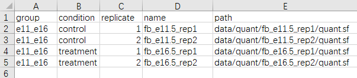


#### diffSplice
**ds** 是 **diffSplice** 的短别名，两个功能一样. **astk** 的AS 差异分析的核心算法基于**SUPPA2**. 然而在**astk**, 将执行AS 差异分析步骤进行简化，使得方便使用:

```bash
$ astk ds -od fb_e11_e16 -md fb_e11_e16_meta.json -gtf gencode.vM25.annotation.gtf -t all
$ ls fb_e11_e16
dpsi psi  ref  tpm
```

**ds ** 参数:

-  -od: 输出目录
- -md: **meta** 运行输出的json文件
- -gtf: 基因组注释GTF文件
- -t: AS类型, all 表示所有软件支持AS类型

**diffSplice**输出包含4个目录: 

- ref 目录包含参考注释文件; 
- tpm 目录包含样本TPM文件; 
- psi 目录包含AS事件PSI值文件; 
- dpsi 目录包含AS差异分析结果.

#### lenCluster

**lenCluster** 用于聚类AS事件，根据alternative exon/intron长度大小。软件提供了两种方法进行聚类： 用户自定义长度范围聚类以及使用k-mean 聚类算法根据exon 长度和数量分布. **lc** 其短别名.

```bash
$ astk lenCluster -i fb_e11_e16/ref/annotation_SE_strict.ioe -cl 51 300 -bw 3 -o fb_e11_e16/mm25_SE_cluster.png   
$ ls fb_e11_e16/mm25_SE_cluster*
fb_e11_e16/mm25_SE_cluster_cls_info.csv  fb_e11_e16/mm25_SE_cluster.cluster.csv  fb_e11_e16/mm25_SE_cluster.png
```

**lc** 参数:

- -i: AS 事件 ioe 文件，可由 **astk** 或者**suppa2**生成
- -cl: 自定义长度类别, 51 300  表明that 1-51是一类, 52-300是一类，以及长度 > 300是一类
- -bw: 直方图bin 宽度
- -o:  输出名字

**lenCluster**输出包含3个文件: 
- png文件，以图片形式展示exon分布有以及类别
- csv文件，以文本形式展示，分类的信息


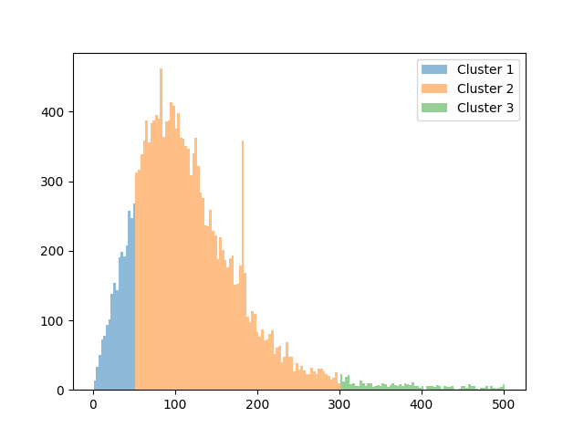

#### sigfilter 

**sigfilter** 用于根据p-val 和dPSI 来筛选AS差异事件， **sf**其短名.

```bash
$ astk sf -md fb_e11_e16_meta.json -od fb_e11_e16/sig01 -adpsi 0.1 -p 0.05
```

**sf** 参数

- -md: meta 运行输出的json文件
- -od : 输出目录
- -adpsi: dpsi绝对值
- -p: p-value

**sigfilter**输出包含5种文件类型 (- adpsi):

- 以"c1.sig.psi" 后缀结尾是condition 1(control) PSI 文件

- 以"c2.sig.psi" 后缀结尾是condition 2(treatment) PSI 文件

- 以"sig.dpsi" 后缀结尾是包含所有的AS 差异分析结果

- "sig+.dpsi"  后缀结尾是dPSI > adpsi的AS 差异分析结果

- "sig-.dpsi" 后缀结尾是dPSI < adpsi的AS 差异分析结果

  

#### pca

**pca** 子命令用于PSI PCA 分析绘图.

```bash
$ astk pca -i fb_e11_e16/sig01/e11_e16_SE_c*.sig.psi -o fb_e11_e16/pca.png
```

**pca** arguments

- -i : PSI 文件

- -o: 输出图片

  

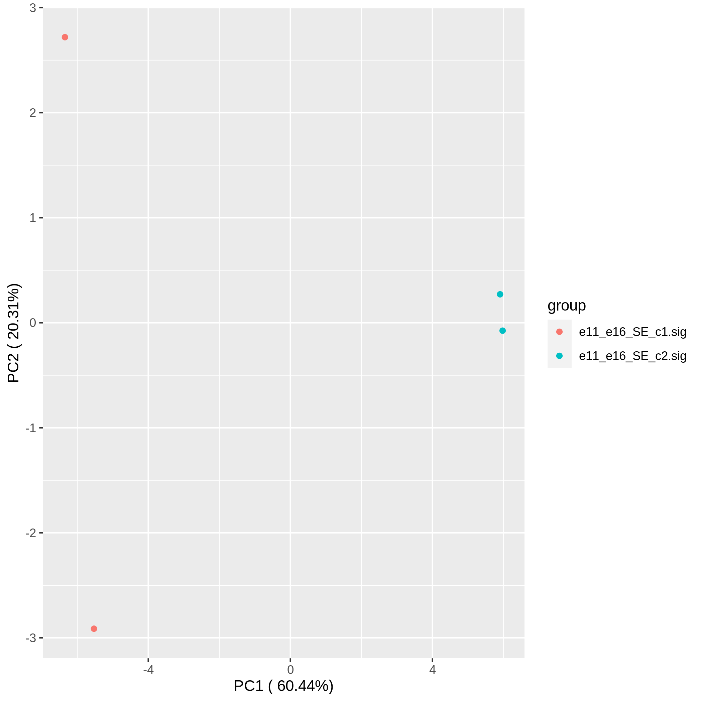


#### heatmap

**heatmap** 用于PSI热图绘制. **hm** 是其短名. **lenCluster**的聚类信息可用于热图分类.

```bash
$ astk hm -i fb_e11_e16/sig01/e11_e16_SE_c*.sig.psi -o fb_e11_e16/heatmap.png -cls fb_e11_e16/mm25_SE_cluster_cls_info.csv
```

**heatmap** arguments

- -i : PSI 文件
- -o: 输出图片地址
- -cls: AS 聚类信息文件，由**lenCluster**，生成，可选。

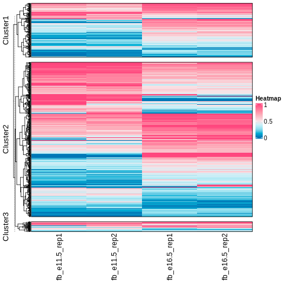

####  volcano

**volcano** 用于dPSI火山图绘制.  **vol** 其短名 .

```bash
$ astk vol -i fb_e11_e16/dpsi/e11_e16_SE.dpsi -od fb_e11_e16/
```

**vol** arguments:

- -i: 输入dpsi文件, 可多个
- -od: 输出目录 

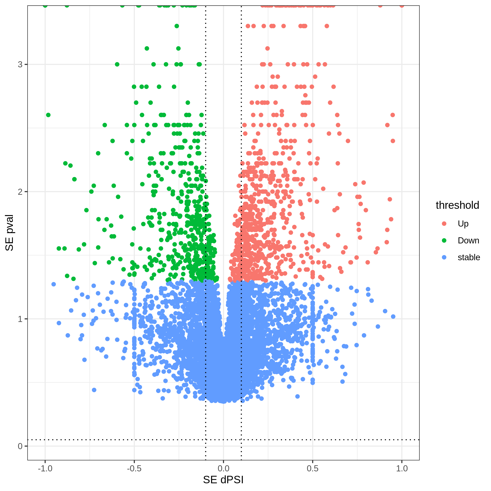

#### enrich

**enrich** 用于基因 GO term和 KEGG pathway 富集分析. 使用了clusterProfiler，simplifyEnrichment进行分析。

```bash
$ astk enrich -i fb_e11_e16/sig01/e11_e16_SE.sig[-,+].dpsi -od fb_e11_e16/SE_enrich -pval 0.1 -qval 0.1 -db GO -orgdb mm
$ ls fb_e11_e16/SE_enrich
e11_e16_SE.sig-  e11_e16_SE.sig+
$ tree fb_e11_e16/SE_enrich/e11_e16_SE.sig-
fb_e11_e16/SE_enrich/e11_e16_SE.sig-
├── GO.ALL.qval0.1_pval0.1.csv
├── GO.ALL.qval0.1_pval0.1.pdf
├── GO.BP.qval0.1_pval0.1.csv
├── GO.BP.qval0.1_pval0.1.pdf
├── GO.CC.qval0.1_pval0.1.csv
├── GO.CC.qval0.1_pval0.1.pdf
├── GO.MF.qval0.1_pval0.1.csv
├── GO.MF.qval0.1_pval0.1.pdf
├── goplot
│   ├── GO.BP_goplot.pdf
│   ├── GO.CC_goplot.pdf
│   └── GO.MF_goplot.pdf
└── simgo
    ├── GO_BP_simple.csv
    ├── GO_BP_simple.pdf
    ├── GO_CC_simple.csv
    ├── GO_CC_simple.pdf
    ├── GO_MF_simple.csv
    └── GO_MF_simple.pdf
```

**enrich ** 参数:

- -i : dpsi 文件，可多个
- -od : 输出目录
- -pval : p-value
- -qval : q-value
- -db :  富集数据库, GO or KEGG
- -orgdb : OrgDb注释包代码, 运行`astk ls -orgdb` 查看注释包对应代码

GO terms 富集结果包含了图片格式，以及对应表格文件，还有GO 富集term 网络图和分类热图。 

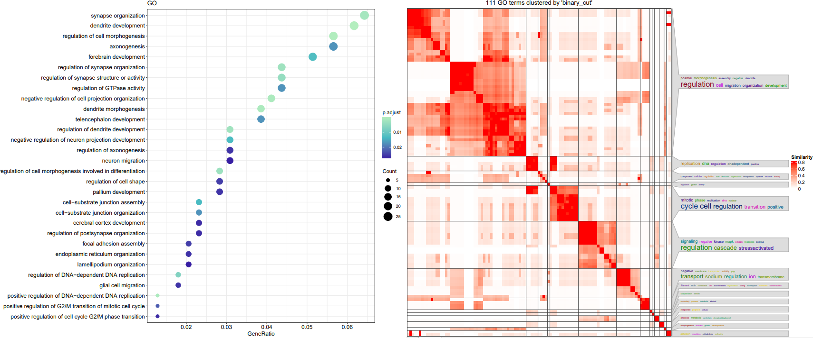
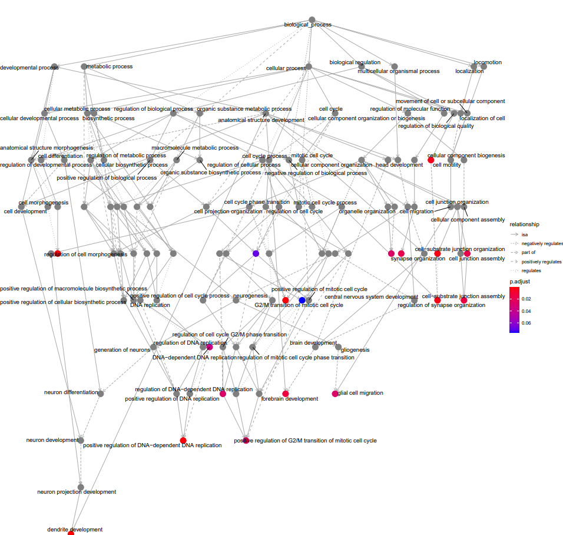
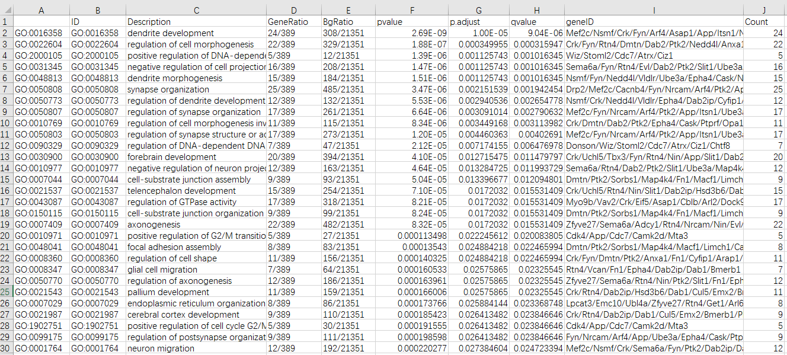


#### gsea
**gsea** 用于基因集富集分析，支持GO/KEGG数据库，可变剪切基因将根据dPSI值进行排序作为输入。
```bash
### run gsea
$ astk gsea -i fb_e11_e16/sig01/e11_e16_SE.sig.dpsi -od fb_e11_e16/gsea -n dpsi_GO -orgdb mm -db GO -pval 0.1
$ ls fb_e11_e16/gsea
dpsi_GO.csv  dpsi_GO.RDat
### gsea plot
$ astk gseplot -id GO:0051049 GO:0030182 -rd fb_e11_e16/gsea/dpsi_GO.RData -o fb_e11_e16/gsea/dpsi_GO.png
$ ls fb_e11_e16/gsea
dpsi_GO.csv  dpsi_GO.png  dpsi_GO.RData
```

**gsea** 参数说明:
- -i： dpsi文件地址
- -od: 输出目录
- -n: 文件名
- orgdb : OrgDb注释包代码, 运行`astk ls -orgdb` 查看注释包对应代码
- -db : GO/KEGG 选择
- pval: pval

**gseplot** 参数说明:
- -id： term id
- -rd: **gsea**运行输出的RData文件
- -n: 文件名
- -o: 输出图片地址

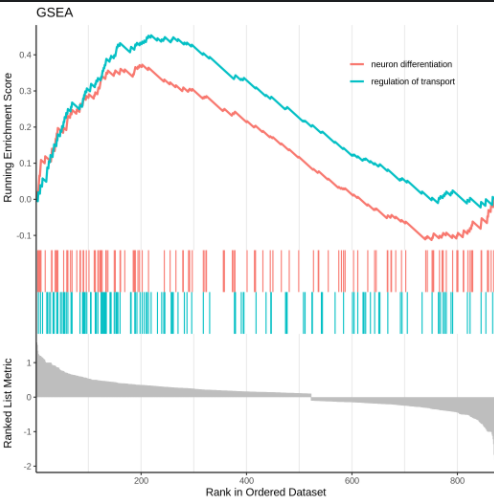

#### enrichLenCluster

**enrichLenCluster**:  **lenCluster** 聚类结果的基因功能比较， 短名: **elc**

在之前的代码中, AS 事件 被划分三类 (1-51nt, 51-300nt 和 >300nt) . **enrichLenCluster** 可用于比较这三类的AS基因功能。

```bash
$ astk elc -i fb_e11_e16/sig01/e11_e16_SE.sig-.dpsi \ 
  -cls fb_e11_e16/mm25_SE_cluster_cls_info.csv -od fb_e11_e16/elc_3_SE- \
  -db GO -pval 0.1 -qval 0.1 -orgdb mm 
$ tree fb_e11_e16/elc_3_SE-  
fb_e11_e16/elc_3_SE-
├── e11_e16_SE.sig-.cmp.BP.qval0.1_pval0.1.pdf
├── e11_e16_SE.sig-.cmp.CC.qval0.1_pval0.1.pdf
└── e11_e16_SE.sig-.cmp.MF.qval0.1_pval0.1.pdf
```

#### enrichCompare

**enrichCompare** 用于不同组基因的功能比较, 短名: **ecmp**. 

这里比较AS差异事件中 dPSI > 0.1 和 dPSI < 0.1 基因功能 (fb_11.5, fb_16.5)

```bash
$ astk ecmp -i demo/sig/7_SE.sig[+,-].dpsi -o demo/cmp_7_se -db GO -pval 0.1 -qval 0.1 -orgdb mm
$ tree demo/cmp_7_se
demo/cmp_7_se
├── GO.cmp.BP.qval0.1_pval0.1.pdf
├── GO.cmp.CC.qval0.1_pval0.1.pdf
└── GO.cmp.MF.qval0.1_pval0.1.pdf
```

**enrichCompare** 参数:

- -i : dpsi 文件
- -od : 输出目录
- -pval : p-value
- -qval : q-value
- -db :  富集数据库, GO or KEGG
- -orgdb : OrgDb注释包代码, 运行`astk ls -orgdb` 查看注释包对应代码

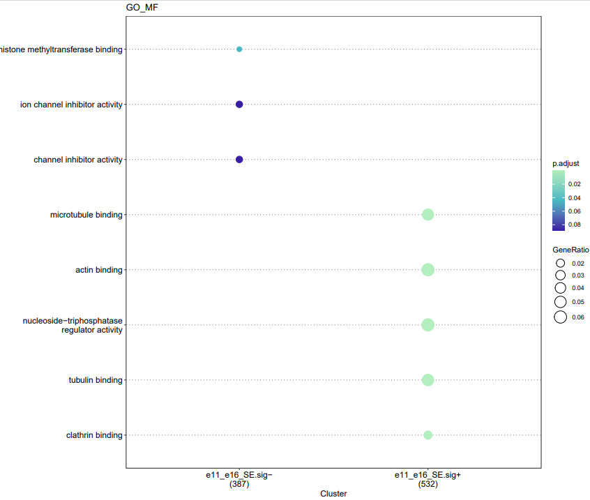


**enrichLenCluster** 参数:

- -i : dpsi 文件
- -cls : AS 事件聚类json文件，由**lenCluster**生成
- -od : 输出目录
- -pval : p-value
- -qval : q-value
- -db :  富集数据库, GO or KEGG
- -orgdb : OrgDb注释包代码, 运行`astk ls -orgdb` 查看注释包对应代码

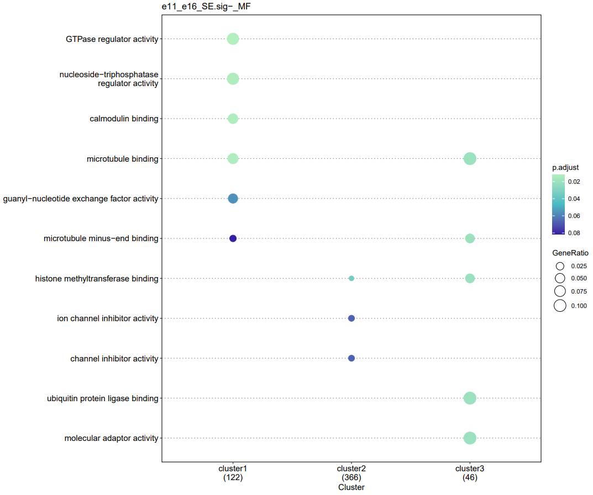

#### motifEnrich
**motifEnrich** 用于Motfi富集分析，使用meme-suite软件软法进行分析。短别名： **me**

在上图中，若我们想了解e1, s3两个剪切位点附近300bp长度内可能存在的motif。**astk** 提供了一个很方便的命令用于快速获取AS事件中剪切位点坐标。

```
$ astk getcoor -i fb_e11_e16/sig01/e11_e16_SE.sig.dpsi \ 
  -o fb_e11_e16/SE.sig.e1.w300.bed -anchor 1 -u 150 -e 150
$ astk getcoor -i fb_e11_e16/sig01/e11_e16_SE.sig.dpsi  \
  -o fb_e11_e16/SE.sig.s3.w300.bed -anchor 4 -u 150 -e 150
$ ls fb_e11_e16/SE.sig.*.w300.bed
fb_e11_e16/SE.sig.e1.w300.bed  fb_e11_e16/SE.sig.s3.w300.bed
```
**getcoor** 参数：
- -i： dpsi文件
- -o: 输出地址
- -anchor 锚点索引，上图,e1,s2,e2,s3，分别为1,2,3,4
- -u: 锚点上游偏移量
- -d: 锚点下游偏移量

然后可通过bedtools软件获取对应坐标序列
```bash
$ bedtools getfasta -fi GRCm38.primary_assembly.genome.fa -bed fb_e11_e16/SE.sig.s3.w300.bed -fo fb_e11_e16/SE.sig.s3.w300.fa
$ bedtools getfasta -fi GRCm38.primary_assembly.genome.fa -bed fb_e11_e16/SE.sig.e1.w300.bed -fo fb_e11_e16/SE.sig.e1.w300.fa
$ ls fb_e11_e16/SE.sig.*.w300.fa
fb_e11_e16/SE.sig.e1.w300.fa  fb_e11_e16/SE.sig.s3.w300.fa
```
运行**motifEnrich**：
```bash
astk me -fa fb_e11_e16/SE.sig.*.w300.fa -od fb_e11_e16/me_se14 -mm HOCOMOCOv11_full_MOUSE_mono_meme_format.meme
```
**motifEnrich** 参数:
- -fa: 输入fasta 序列文件
- -od: 输出目录
- -mm: meme格式的motif数据库文件，可从https://meme-suite.org/meme/doc/download.html获取

**motifEnrich**输出：
```
$ tree fb_e11_e16/me_se14
fb_e11_e16/me_se14
├── heatmap.pdf
├── SE.sig.e1.w300
│   ├── ame.html
│   ├── ame.tsv
│   └── sequences.tsv
└── SE.sig.s3.w300
    ├── ame.html
    ├── ame.tsv
    └── sequences.tsv
```
文件夹内是fasta序列motif富集结果，heatmap.pdf是富集motif pval热图展示
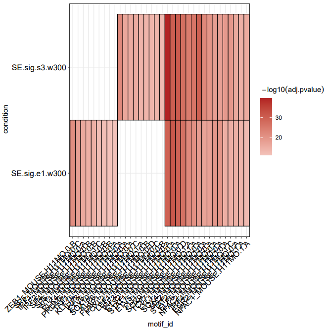
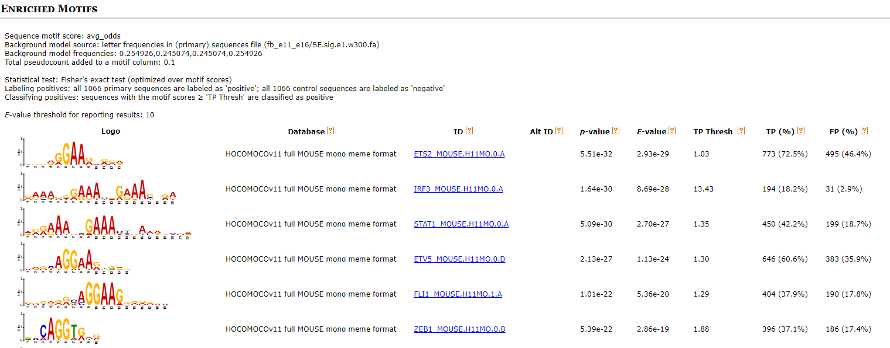

#### learnState
**learnState** 用于整合表观遗传修饰，可查看AS事件剪切位点，exon/intron 表观修饰情况，基于ChromHMM软件算法。从ENCODE上获取小鼠前脑e11.5,e16.5 8种组蛋白修饰ChIP-seq peak文件。
```bash
$ ls data/peak/*.e1[16].5.fb.bed.gz
data/peak/H3K27ac.e11.5.fb.bed.gz   data/peak/H3K36me3.e11.5.fb.bed.gz  data/peak/H3K4me2.e11.5.fb.bed.gz  data/peak/H3K9ac.e11.5.fb.bed.gz
data/peak/H3K27ac.e16.5.fb.bed.gz   data/peak/H3K36me3.e16.5.fb.bed.gz  data/peak/H3K4me2.e16.5.fb.bed.gz  data/peak/H3K9ac.e16.5.fb.bed.gz
data/peak/H3K27me3.e11.5.fb.bed.gz  data/peak/H3K4me1.e11.5.fb.bed.gz   data/peak/H3K4me3.e11.5.fb.bed.gz  data/peak/H3K9me3.e11.5.fb.bed.gz
data/peak/H3K27me3.e16.5.fb.bed.gz  data/peak/H3K4me1.e16.5.fb.bed.gz   data/peak/H3K4me3.e16.5.fb.bed.gz  data/peak/H3K9me3.e16.5.fb.bed.gz
```

先生成软件需要的mark 文件
```bash
$ astk mark -o fb_e11.mark.txt -sep "." -mi 1 -mn 8 -ct e11 -bed data/peak/*.e11.5.fb.bed.gz 
$ astk mark -o fb_e16.mark.txt -sep "." -mi 1 -mn 8 -ct e16 -bed data/peak/*.e16.5.fb.bed.gz 
$ cat fb_e11.mark.txt
e11     H3K27ac data/peak/H3K27ac.e11.5.fb.bed.gz
e11     H3K27me3        data/peak/H3K27me3.e11.5.fb.bed.gz
e11     H3K36me3        data/peak/H3K36me3.e11.5.fb.bed.gz
e11     H3K4me1 data/peak/H3K4me1.e11.5.fb.bed.gz
e11     H3K4me2 data/peak/H3K4me2.e11.5.fb.bed.gz
e11     H3K4me3 data/peak/H3K4me3.e11.5.fb.bed.gz
e11     H3K9ac  data/peak/H3K9ac.e11.5.fb.bed.gz
e11     H3K9me3 data/peak/H3K9me3.e11.5.fb.bed.gz
```

生成需要观察AS事件上，需要观察的坐标位置信息
```bash

mkdir fb_e11_e16/epi/SE -p
mkdir fb_e11_e16/epi/SE/{ss_coors,ss_anchors}

#### 分别提取SE AS事件的4个剪切位点上下游250bp范围的坐标
for i in {1..4}; do 
    astk getcoor -i fb_e11_e16/sig01/e11_e16_SE.sig-.dpsi -ss -anchor $i -u 250 -d 0 -o fb_e11_e16/epi/SE/ss_coors/SE_sig-_a${i}_uf250.bed;
    astk getcoor -i fb_e11_e16/sig01/e11_e16_SE.sig-.dpsi -ss -anchor $i -u 0 -d 250 -o fb_e11_e16/epi/SE/ss_coors/SE_sig-_a${i}_df250.bed;

    astk getcoor -i fb_e11_e16/sig01/e11_e16_SE.sig+.dpsi -ss -anchor $i -u 250 -d 0 -o fb_e11_e16/epi/SE/ss_coors/SE_sig+_a${i}_uf250.bed;
    astk getcoor -i fb_e11_e16/sig01/e11_e16_SE.sig+.dpsi -ss -anchor $i -u 0 -d 250 -o fb_e11_e16/epi/SE/ss_coors/SE_sig+_a${i}_df250.bed;
done

### 设置SE AS事件的4个剪切位点 作为锚点坐标观察其附近组蛋白修饰情况
for i in {1..4}; do 
    astk anchor -i fb_e11_e16/sig01/e11_e16_SE.sig-.dpsi -idx $i -ss -o fb_e11_e16/epi/SE/ss_anchors/SE_sig-_a${i}.bed;
    astk anchor -i fb_e11_e16/sig01/e11_e16_SE.sig+.dpsi -idx $i -ss -o fb_e11_e16/epi/SE/ss_anchors/SE_sig+_a${i}.bed; 
done
```

运行**learnState**
```bash
$ astk lcs -n 6 -mark fb_e11.mark.txt --name e11 -bd fb_e11_e16/epi/SE/fb_e11_ss_binary \
    -od fb_e11_e16/epi/SE/fb_e11_ss_state -b 100 -g mm10 -mx 9600M -p 60 \
    -anchor fb_e11_e16/epi/SE/ss_anchors -coor fb_e11_e16/epi/SE/ss_coors

$ astk lcs -n 6 -mark fb_e16.mark.txt --name e16 -bd fb_e11_e16/epi/SE/fb_e16_ss_binary \
    -od fb_e11_e16/epi/SE/fb_e16_ss_state -b 100 -g mm10 -mx 9600M -p 60 \
    -anchor fb_e11_e16/epi/SE/ss_anchors -coor fb_e11_e16/epi/SE/ss_coors    

$ ls  fb_e11_e16/epi/SE
fb_e11_ss_binary  fb_e11_ss_state  fb_e16_ss_binary  fb_e16_ss_state  ss_anchors  ss_coors
```
**learnState** 参数：
- -n: Chromatin state数目
- -mark: mark文件地址
- --name: 文件表示名
- -bd: binary输出目录
- -od: 结果输出目录
- -b: bin size
- -g: 基因组
- -mx: 最大使用内存
- -p: 进程数
- -anchor: 包含anchor文件的目录
- -coor: 包含coor的目录

输出,总的输出报告是html文件
```bash
$ ls  fb_e11_e16/epi/SE/fb_e1*_ss_state/*.html
fb_e11_e16/epi/SE/fb_e11_ss_state/webpage_6_e11.html  fb_e11_e16/epi/SE/fb_e16_ss_state/webpage_6_e16.html
```
这里选取html里的部分图片进行展示.
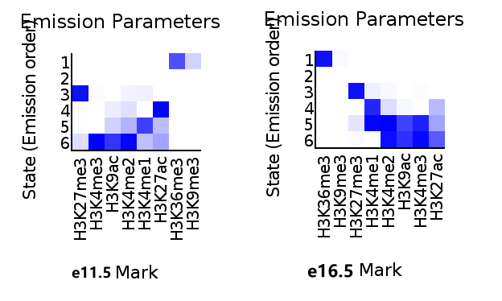

上图，分别为e11.5, e16.5 的组蛋白修饰Chromatin state分类
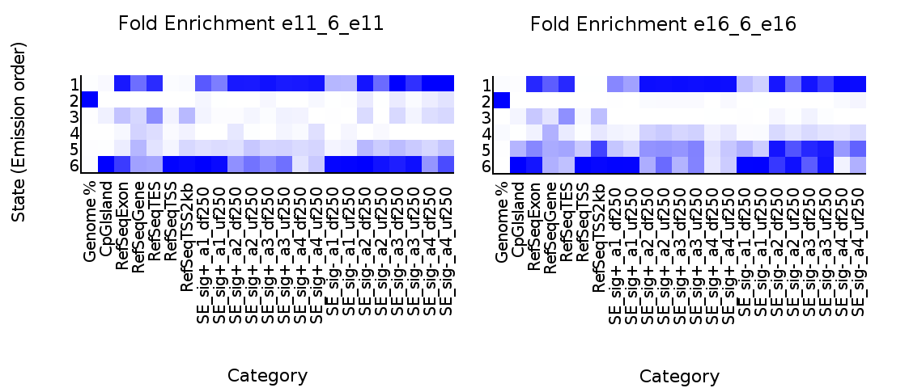

上图，为自定义的坐标范围（SE AS事件的四个剪切位点上，下游250bp范围）内的组蛋白富集情况

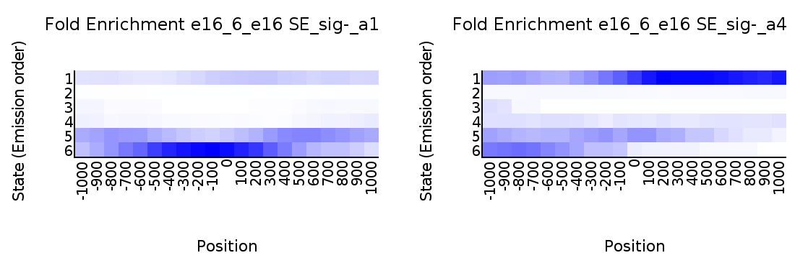
上图，为预先设置好锚点（0点）观察锚点上下游的组蛋白修饰富集情况

### 参考
> Trincado JL, Entizne JC, Hysenaj G, Singh B, Skalic M, Elliott DJ, Eyras E. SUPPA2: fast, accurate, and uncertainty-aware differential splicing analysis across multiple conditions. Genome Biol. 2018 Mar 23;19(1):40. doi: 10.1186/s13059-018-1417-1. PMID: 29571299; PMCID: PMC5866513.
Wu T, Hu E, Xu S, Chen M, Guo P, Dai Z, Feng T, Zhou L, Tang W, Zhan L, Fu X, Liu S, Bo X, Yu G. clusterProfiler 4.0: A universal enrichment tool for interpreting omics data. Innovation (N Y). 2021 Jul 1;2(3):100141. doi: 10.1016/j.xinn.2021.100141. PMID: 34557778; PMCID: PMC8454663.
McLeay RC, Bailey TL. Motif Enrichment Analysis: a unified framework and an evaluation on ChIP data. BMC Bioinformatics. 2010 Apr 1;11:165. doi: 10.1186/1471-2105-11-165. PMID: 20356413; PMCID: PMC2868005.
Ernst J, Kellis M. ChromHMM: automating chromatin-state discovery and characterization. Nat Methods. 2012 Feb 28;9(3):215-6. doi: 10.1038/nmeth.1906. PMID: 22373907; PMCID: PMC3577932.
Zuguang Gu, et al., simplifyEnrichment: an R/Bioconductor package for Clustering and Visualizing Functional Enrichment Results, 2021 bioRxiv. doi: https://doi.org/10.1101/2020.10.27.312116